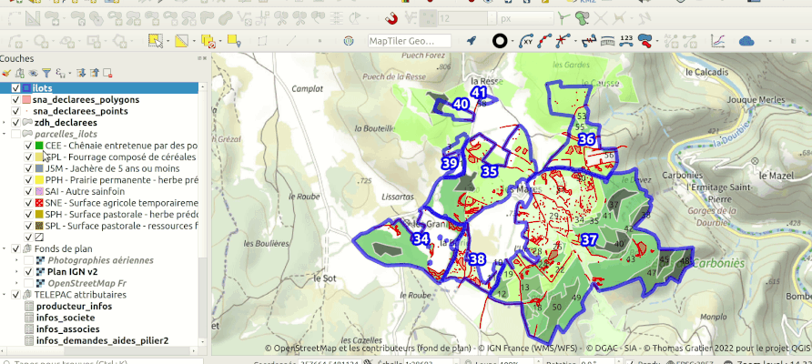

# Parsing fichier XML Telepac

L'idée de ce parser est venue de cette discussion https://georezo.net/forum/viewtopic.php?pid=356673#p356673

Vous pouvez prendre les fichiers qui sont proposés sur la précédente URL pour tester le parser mis à disposition (nous ne mettons pas les fichiers ici pour limiter la propagation de données à caractère personnel de l'utilisateur ayant choisi de les mettre à disposition)



## Guide d'utilisation pour créer la donnée

Il faut avoir lxml et gdal d'installé au niveau de Python. Si vous avez QGIS installé, vous devez avoir les 2 déjà.

Ensuite, faire

    python3 read_pac_xml.py <nom_du_fichier_telepac>.xml

où `<nom_du_fichier_telepac>` est le nom de votre fichier

Cela créé une liste de fichiers GeoJSON et CSV. Attention! Nous avons créé un GeoJSON pour nous faciliter la vie pour la manipulation des données lors du traitement.
Normalement, un GeoJSON selon la norme est sensé être en EPSG 4326. Ici il est en EPSG 2154 pour conserver la précision des données des fichiers d'origine.

Vous avez alors 2 choix pour consommer les données:

- soit vous ajoutez tous les fichiers GeoJSON et CSV créés
- soit vous ajoutez le GPKG qui contiendra le même contenu que dans les fichiers précédents.

Le cas 1 est utile, si vous voulez passer par des tableurs pour certaines manipulations et le cas 2, plutôt si vous restez dans un logiciel SIG comme QGIS.

**Portabilité du script**

Celui-ci a été testé avec un script Telepac commençant par le xml suivant c'est à dire avec une structure avec un schéma xsd "Echanges-producteur-export-2022-V4".

```xml
<?xml version="1.0" encoding="ISO-8859-1"?>
 <producteurs xmlns="urn:x-telepac:fr.gouv.agriculture.telepac:echange-producteur" xmlns:gml="http://www.opengis.net/gml"><producteur numero-pacage="xxxxxxxxx" campagne="Courante" fichier-xsd="Echanges-producteur-export-2022-V4">
```

Il doit potentiellement casser pour des exports d'autres versions de schémas comme ci-dessous

```xml
<?xml version="1.0" encoding="ISO-8859-1"?>
<producteurs xmlns="urn:x-telepac:fr.gouv.agriculture.telepac:echange-producteur" xmlns:gml="http://www.opengis.net/gml"><producteur numero-pacage="xxxxxxxxx" campagne="Courante" fichier-xsd="Echanges-producteur-export-2019-V3">
```

## Projet QGIS de base

Il y a surement des choses à améliorer mais voici un document de base. Il utilise les fichiers GeoJSON et GPKG. Vous pouvez réassigner la source si nécessaire.

Il faut noter qu'il peut y avoir des problèmes liés aux types. Les CSV par exemple ne sont pas chargés avec un fichier associé CSVT pour explicitement déclaré le type de chaque colonne.

Il manque des associations/relations entre des tables qui pourraient être bénéfiques pour l'exploitation des données.

## Utile que côté développeur

Pour ne pas oublier des éléments lors du traitement

```bash
wget https://github.com/relaxng/jing-trang/releases/download/V20181222/trang-20181222.zip
unzip -j trang-20181222.zip

java -jar trang.jar Dossier-PAC-2022_dossier_012000001_20220000000008_cleaned.xml schema.xsd
```

Cela permet de documenter un xml dont la structure est inconnue
